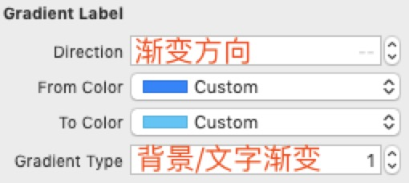
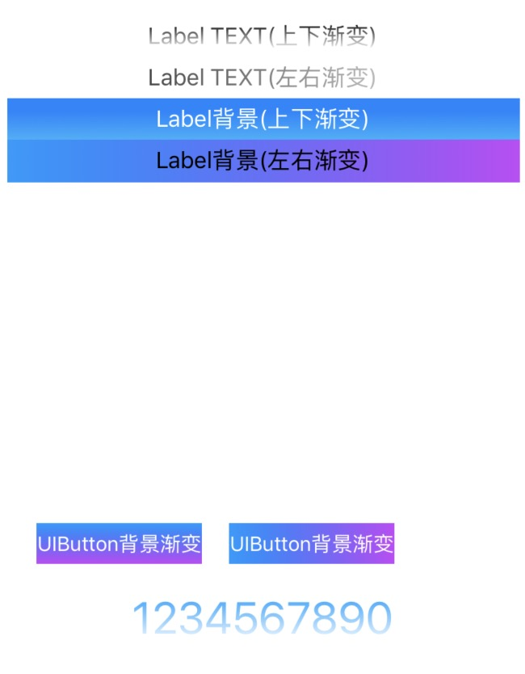

# GradientX

[](https://cocoapods.org/pods/GradientX)
[](https://cocoapods.org/pods/GradientX)


## Requirements
```ruby
iOS 8.0+
```

## Installation

Gradient is available through [CocoaPods](https://cocoapods.org). To install
it, simply add the following line to your Podfile:

```ruby
pod 'GradientX'
```


## Usage


```swift
//MARK: - Label
let label = GradientLabel()

///更改颜色
label.new(colors: [UIColor.red.cgColor, UIColor.black.cgColor, UIColor.white.cgColor])

/// 更改方向
label.new(direction: .vertical)


//MARK: - Button
let button = GradientButton()

///更改颜色
button.new(colors: [UIColor.red.cgColor, UIColor.black.cgColor, UIColor.white.cgColor])

/// 更改方向
button.new(direction: .vertical)
```


#### Storyboard




## ScreenShots



## Author

Tyrant, rex_wzc@163.com


